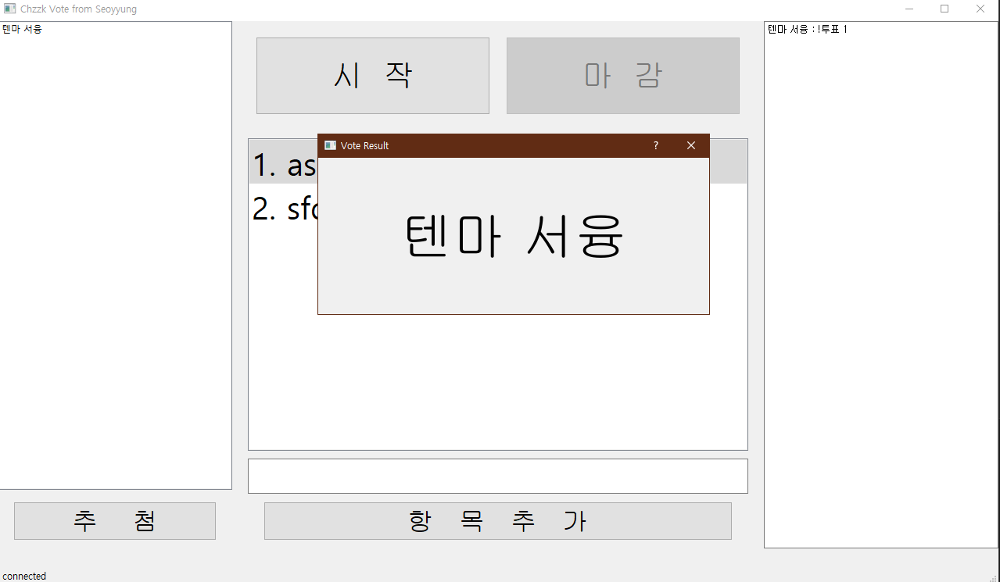

# Chzzk_Vote
파이썬 치지직 투표기

파이썬을 이용해 채팅을 크롤링 후 "!투표 1" 과 같은 채팅을 감지하여 투표합니다.

이 코드는 [Buddha7771](https://github.com/Buddha7771/ChzzkChat) 님의 코드를 기반으로 작성되었습니다.

아래는 Anaconda가 정상 설치되었다는 가정하의 튜토리얼입니다.

## 설치 - 명령어 실행
    # 코드 다운로드
    $ git clone https://github.com/sy-project/Chzzk_Vote.git .
    $ cd Chzzk_Vote

    # 가상환경 설치
    $ conda create -n chzzk python=3.9
    $ conda activate chzzk

    # 패키지 설치
    $ pip install -r requirements.txt

## 설치 - bat 파일 실행
    # 코드 다운로드 - zip 압축파일
    `< > Code` 클릭 > `Download ZIP` 클릭

    # 가상환경 & 패키지 설치 - bat 파일
    `install.bat` 실행

## 준비하기
1. 웹 브라우저에서 네이버를 키고 개발자 도구(F12)를 킵니다.
2. 쿠키탭에 들어가 `NID_AUT`와 `NID_SES` 값을 찾습니다.
3. 해당 값들을 `cookies.json` 파일에 들어가 붙여 넣습니다.

## 사용하기
    # 예시 - 명령어 실행
    python main.py 

    # 예시 - bat 파일
    `start.bat` 실행

    # 특정 채널에 적용하려면 아이디를 찾아 옵션으로 넣습니다.
    채널의 링크가 `https://chzzk.naver.com/a3f9b654ff36bb29ab53eb38c25faab9` 일 경우 아래와 같이 작성을 해줍니다.
    python main.py --streamer_id a3f9b654ff36bb29ab53eb38c25faab9

    # 작동 순서
    - `항목추가` 버튼 위 공백란에 `승리` 혹은 `패배` 와 같은 항목을 적은 후 `항목추가` 버튼을 눌러줍니다.
    - 중앙 상단의 `시작` 버튼을 누른 시점부터 `마감` 버튼을 누른 시점까지 채팅 확인하며 좌측의 공간에 한명씩 닉네임이 들어갑니다.
    - `마감` 버튼을 클릭 후 추첨하고자 하는 항목을 먼저 클릭하고, 좌측하단의 `추첨`을 눌러주게 되면 랜덤으로 시청자의 닉네임이 화면 가운데에 팝업으로 뜨게됩니다.

    # 주의할점
    - `추첨` 버튼을 눌러서 나온 닉네임은 좌측의 리스트에서 제외됩니다.

  

> 출력 내용은 자동으로 chat.log에 저장됩니다.   
> 작동을 중지하려면 `ctrl + c' 혹은 X표 를 눌러주세요
